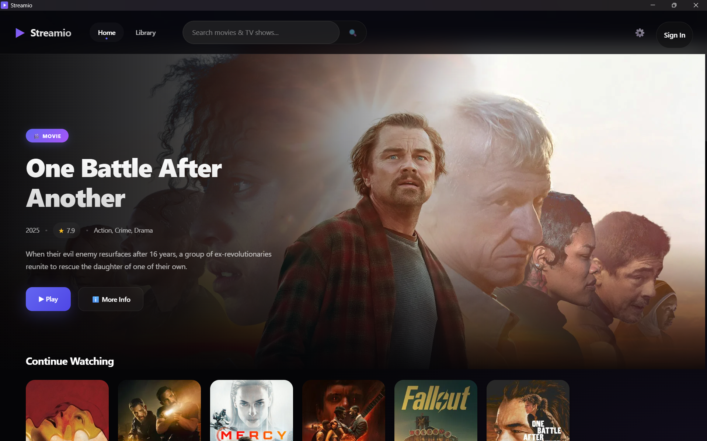
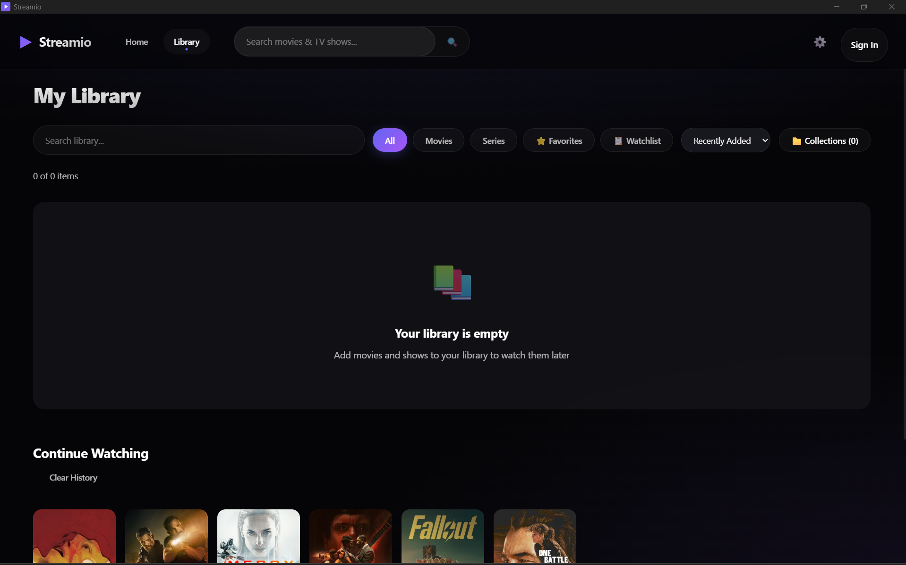
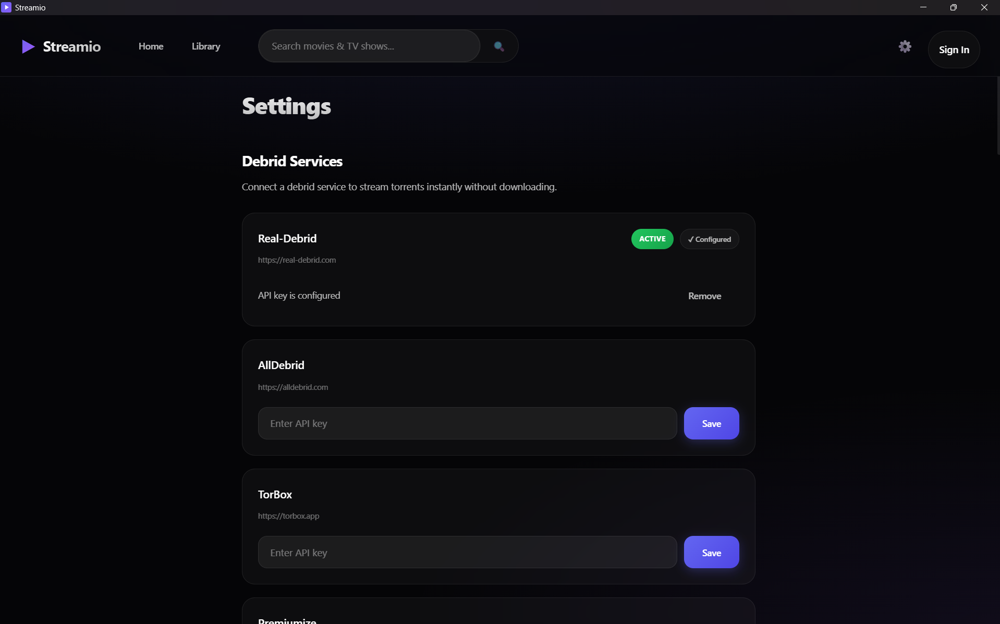
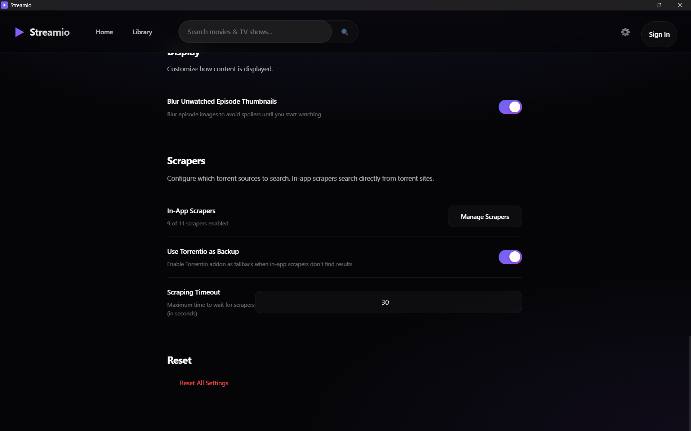

# Vreamio

**A cross-platform streaming application** built with Tauri (desktop) and Node.js (backend). Vreamio aggregates torrent sources and streams content through debrid service HTTPS endpoints. Currently a standalone desktop app, with plans to expand to every platform including TV, mobile, and web.

---

## Table of Contents

- [Service Overview](#service-overview)
- [How It Works](#how-it-works)
- [Features](#features)
- [TorBox Integration — Current State](#torbox-integration--current-state)
- [TorBox Partnership Proposal](#torbox-partnership-proposal)
- [Customer Demographic](#customer-demographic)
- [Marketing Plan](#marketing-plan)
- [Development Status](#development-status)
- [Tech Stack](#tech-stack)
- [Architecture](#architecture)
- [Screenshots](#screenshots)
- [License](#license)

---

## Service Overview

Vreamio is currently a **standalone desktop application** (Windows, macOS, Linux) that provides a Netflix-like experience for accessing media content through debrid services. Built with Tauri, React 18, and an embedded MPV video player, Vreamio is planned to expand to every platform including TV, mobile, and web to create a full cross-platform ecosystem.

**Service Type:** Streaming client with debrid service integration.

The application currently operates on a **BYOD (Bring Your Own Debrid)** model where users manually supply their own debrid API key. Before the actual launch of Vreamio, we are aiming to have a whitelabel integration with TorBox to provide a seamless experience where customers can get a subscription directly in-app. This simplifies the existing method of manually entering an API key and creates an overall more seamless experience of a full ecosystem. We are also planning to have everything synced between your account so that all user data (library, watch history, preferences) is synced across all platforms.

**What makes Vreamio different from Stremio and similar apps:**

Vreamio is a **native desktop app**, not Electron and not a web wrapper. It is built on Tauri with Rust for performance and a small footprint. The **embedded MPV player** (libmpv) supports DTS, Dolby Atmos, TrueHD, 4K HDR, Dolby Vision, and exotic codecs that browser-based players cannot handle.

Vreamio features a **Safety Gate architecture**, a hard-coded enforcement layer that blocks all P2P traffic. Every stream must resolve to a valid debrid HTTPS URL before playback is allowed, with no fallback to direct torrent connections under any circumstance.

All torrent discovery and debrid communication happens **client-side** on the user's machine. The backend server only handles user accounts and library sync, keeping it lightweight and cleanly separated from content sourcing.

---

## How It Works

1. **Browse & Search** — Users browse curated catalog rows (Popular Movies, Popular Series, Top Rated) or search by title. Metadata is sourced from Cinemeta.
2. **Select Content** — The details page shows full metadata (title, year, runtime, rating, genres, cast, director) and for series, a full season/episode browser.
3. **Scrape Sources** — When a user selects content, Vreamio runs all enabled scrapers in parallel (configurable timeout, default 30s) to find available torrent sources. Each result is instantly checked against the user's debrid service for cache availability.
4. **Stream via Debrid** — The user picks a source (or the app auto-selects the highest-ranked cached result). The magnet is sent to the debrid API, which returns a direct HTTPS stream URL. Playback begins immediately.
5. **Watch & Resume** — Progress is saved automatically. The Continue Watching row on the home page shows progress bars, remaining time, and restores the exact same torrent source, subtitle selection, and audio track on resume.

---

## Features

### Home Page & Discovery

- **Hero banner** showcasing popular content with backdrop art, rating, year, genres, and instant Watch Now / More Info actions.
- **Continue Watching** row with up to 10 items, progress bars, remaining time, and one-click resume. Deduplicates series (shows only the latest episode per show). Remembers the exact torrent source, subtitle, and audio selections.
- **Curated catalog rows:** Popular Movies, Popular Series, Top Rated Movies, Top Rated Series — all fetched in parallel from Cinemeta.

### Search

- Full-text search with filter tabs: All, Movies, Series (with result counts per category).

### Content Details

- Full metadata display: title, year, runtime, rating, genres, cast, director.
- Season/episode browser for series with selectable seasons.
- **Instant availability badges** showing which torrents are already cached on the user's debrid service (instant playback, no wait).
- Library actions: add/remove, favorite, watchlist, user rating (1–10), custom collections.
- Spoiler protection: option to blur unwatched episode thumbnails.

### Player

- **Dual player engine:** HTML5 `<video>` for simplicity, or **embedded MPV (libmpv)** for full codec support including DTS, Dolby Atmos, TrueHD, 4K HDR, Dolby Vision, AV1, HEVC, and more.
- Full playback controls: play/pause, seek, volume, mute, fullscreen.
- **Live source switching:** browse and switch between available torrent sources mid-playback.
- **Stream info overlay** showing technical details about the active stream.
- **Episode navigation:** for series, navigate between episodes directly from the player.
- **Auto-play next episode** support.

### Subtitles

- Powered by OpenSubtitles (via Stremio's addon proxy — no API key needed).
- 30+ languages supported with full language name mapping.
- SRT/VTT format support with **timing offset adjustment**.
- Configurable appearance: font family (6 options), font size, color, background.
- Metadata display: hearing-impaired flag, foreign-parts-only, rating, download count.
- Subtitle preferences persist per video.

### Audio Tracks

- Full audio track selection with language detection.
- Channel layout info: 2.0, 5.1, 7.1.
- Codec metadata: AAC, AC3, DTS, Atmos.
- Preferred audio language setting applied automatically.

### User Profiles

Vreamio supports **up to 8 user profiles** under a single account, similar to Netflix and Disney+. Each profile operates as its own independent space with a separate watchlist, continue watching progress, library, and preferences. These are not full accounts with separate logins — they are profiles under the main account holder who pays for the service. When you open Vreamio, you are greeted with a "Who's watching?" profile selection screen. You can switch profiles at any time without logging out. This means a household can share one subscription while each family member has a fully personalized experience.

### Library & Collections

- Personal library with add/remove, favorite, watchlist, and user ratings.
- **Filters:** All, Movies, Series, Favorites, Watchlist.
- **Sort:** Recent, Title, Year, Rating, Runtime.
- **Search within library.**
- **Watch history** with clear-all option.
- **Custom collections:** create, rename, delete collections and add/remove items.

### Scraping & Source Discovery

- Runs all enabled scrapers **in parallel** with configurable timeout.
- Built-in scrapers with individual toggle on/off, categorized as General or Anime.
- **Torrentio integration** as a backup source (same backend Stremio uses) — access to 20+ torrent providers including YTS, EZTV, RARBG, 1337x, ThePirateBay, KickassTorrents, TorrentGalaxy, NyaaSi, and more.
- **Title parsing** extracts: quality (4K/1080p/720p/480p), codec (HEVC/x264/AV1), source type (Remux/BluRay/WEB-DL/WEBRip/HDTV), HDR metadata.
- **Ranking system** with multi-factor scoring: resolution, HDR, source, codec, audio, health (seeders), trust, size.

### Debrid Service Support

- **Real-Debrid**, **AllDebrid**, **TorBox**, **Premiumize** — all four major providers.
- Real-time API key validation before saving.
- Instant availability checking (batch up to 100 hashes at a time).
- Built-in rate limiting with exponential backoff retry (2s → 4s → 8s).

### Settings

- Debrid service configuration with real-time validation.
- Playback preferences: auto-play, auto-play next episode, skip intro, skip outro, player type selection (HTML5 vs MPV), preferred audio/subtitle language.
- Scraper configuration: toggle individual scrapers, set scraping timeout.
- Subtitle appearance customization.
- Display preferences (blur unwatched episodes).
- Full settings reset option.

---

## TorBox Integration — Current State

TorBox is already fully integrated as one of Vreamio's supported debrid providers. The integration uses TorBox's full API surface including key validation, account info, magnet submission, torrent lifecycle management, instant availability checking, and link unrestriction.

With this partnership, we will focus on making TorBox the primary and recommended way for users to get their debrid service. Rather than presenting multiple equal options, Vreamio would guide users toward TorBox with a seamless in-app subscription flow, making it the default and most streamlined path to start watching.

---

## TorBox Partnership Proposal

We are seeking a **whitelabel/partner integration** with TorBox to eliminate the BYOD friction and provide a seamless, out-of-the-box streaming experience.

**Current problem:** New users must separately sign up for a debrid service, obtain an API key, and paste it into Vreamio's settings before they can watch anything. This creates significant onboarding friction and drop-off.

**With whitelabel access:**

- **Zero configuration for end users** — Vreamio would work with TorBox out of the box, no API key setup required.
- **Seamless first-run experience** — New users can start watching immediately after installing.
- **In-app TorBox subscription management** — Users could sign up for or manage their TorBox subscription directly within Vreamio.
- **Consistent performance** — A single debrid backend means we can optimize the experience specifically for TorBox's infrastructure and capabilities.
- **Mutual growth** — Every Vreamio user becomes a potential TorBox subscriber. We drive users to TorBox; TorBox provides the infrastructure that makes Vreamio work.

**What we would need:**

- Whitelabel API access or partner API keys.
- Ability to create/manage TorBox accounts on behalf of users (or a redirect-based signup flow).
- Any partner-tier rate limits or pricing structures.

**What TorBox gets:**

- A polished, native desktop client that showcases TorBox's capabilities.
- A direct user acquisition channel — every Vreamio install drives TorBox subscriptions.
- A differentiated offering: TorBox would be the only debrid service with a dedicated, high-quality native desktop streaming client (as opposed to browser-based addons).

---

## Customer Demographic

**Target audience:** Our initial audience consists of tech-savvy media enthusiasts aged 18–40 who want a centralized, Netflix-like streaming experience without juggling multiple subscription services. These users are familiar with debrid services, value high-quality playback (4K, HDR, Dolby Vision, DTS, Atmos), and are part of communities like r/StremioAddons, r/RealDebrid, r/Addons4Kodi, and r/debridmediamanager.

However, with a TorBox whitelabel partnership, we plan to target a much broader audience of **regular consumers**. By removing the technical complexity of API key management and debrid configuration, Vreamio becomes accessible to the average film and series watcher who simply wants to watch content at a more affordable price, in better quality, within a nice and simple ecosystem. The partnership makes the barrier to entry low enough that non-technical users can enjoy the same experience without needing to understand what a debrid service is.

---

## Marketing Plan

**Phase 1 — Community Seeding (Pre-Launch & Early Launch)**

- Share on debrid-related subreddits: r/StremioAddons, r/RealDebrid, r/debridmediamanager, r/Addons4Kodi, r/TorBox.
- Create a dedicated Vreamio Discord server to build a community around the product and provide direct support.
- Word-of-mouth within the existing Stremio user community (Vreamio serves as an alternative).

**Phase 2 — Content & Visibility**

- Blog posts and guides comparing Vreamio to alternatives (Stremio, DMM, etc.) with focus on native playback, codec support, and the TorBox integration.
- SEO-optimized landing page with feature comparison tables.

**Phase 3 — Scaling**

- Regular feature releases and update announcements to maintain community engagement.
- User feedback integration and community-driven feature prioritization.
- Expand platform support (TV, mobile, web) as user base and partnership grow.

---

## Development Status

The desktop application is developed and functional. It is not a concept or prototype — it is a working product that can be built, installed, and used today.

**Current status:**

- Full desktop application (Windows, macOS, Linux) built and running.
- Debrid providers integrated and working (Real-Debrid, AllDebrid, TorBox, Premiumize).
- Dual player engine (HTML5 + embedded MPV) implemented.
- Complete scraping engine with Torrentio integration and multi-factor ranking.
- Subtitle and audio track selection fully functional.
- Library, collections, watch history, and continue watching implemented.
- Backend API with authentication, library sync, and metadata caching.
- Safety Gate architecture enforcing HTTPS-only streaming.

**Next steps:**

With the desktop app as our foundation, we want to test and integrate the TorBox whitelabel API and expand to other platforms (TV, mobile, web) from there. The desktop version serves as the proving ground for the full ecosystem.

The repository is currently public to share with the TorBox team for evaluation. We plan to go public with an official release once the TorBox integration is working, starting with the desktop version first and adding new platforms on the go based on user feedback.

---

## Tech Stack

| Component            | Technology                                                    |
| -------------------- | ------------------------------------------------------------- |
| **Desktop App**      | Tauri, React 18, TypeScript, Zustand, Vite                    |
| **Backend API**      | Node.js, Express, TypeScript, better-sqlite3                  |
| **Video Player**     | MPV (libmpv) embedded via Tauri IPC, HTML5 `<video>` fallback |
| **Metadata**         | Cinemeta (Stremio metadata addon)                             |
| **Subtitles**        | OpenSubtitles (via Stremio addon proxy)                       |
| **Debrid Services**  | Real-Debrid, AllDebrid, TorBox, Premiumize                    |
| **HTTP Client**      | `@tauri-apps/plugin-http` (native, bypasses CORS)             |
| **State Management** | Zustand with persist middleware (localStorage)                |

---

## Architecture

```
Vreamio/
├── api/          # Node.js backend
│   └── src/
│       ├── routes/       # Auth, library, history, metadata, sync
│       ├── middleware/    # Auth validation, error handling, rate limiting
│       ├── database/     # SQLite via better-sqlite3
│       └── services/     # Metadata caching
│
└── desktop/      # Tauri + React desktop app
    ├── src/
    │   ├── pages/        # Home, Details, Player, Library, Search, Settings, Login
    │   ├── components/   # HeroBanner, ContinueWatching, MediaCard, SubtitleOverlay, etc.
    │   ├── services/
    │   │   ├── debrid/       # Provider abstraction, safety gate, rate limiting
    │   │   ├── scraping/     # Engine, parser, ranking, Torrentio, provider registry
    │   │   ├── subtitles/    # OpenSubtitles integration
    │   │   └── metadata/     # Cinemeta client
    │   ├── stores/       # Zustand stores (settings, library, auth)
    │   └── utils/        # Stream parsing, subtitle languages
    └── src-tauri/        # Rust backend (Tauri commands, MPV integration)
```

**Key architectural decisions:**

- **All scraping and debrid communication happens client-side.** The backend server never touches torrent data — it only handles user accounts and library sync.
- **Safety Gate** is a hard-coded enforcement layer, not a configurable setting. It cannot be bypassed or disabled. Every stream must resolve to a valid `https://` URL from a debrid provider before playback is permitted.
- **Debrid API keys are currently stored locally** on the user's machine (Zustand persist → localStorage). We plan to make this synced across platforms through the user's account as we expand to other devices.

---

## Screenshots

### Home Page


_The home page features a hero banner with a randomly selected popular title, a Continue Watching row with progress bars and one-click resume, and curated catalog rows for Popular Movies, Popular Series, Top Rated Movies, and Top Rated Series._

### Library


_The personal library with filtering (All, Movies, Series, Favorites, Watchlist), sorting (Recent, Title, Year, Rating, Runtime), search, watch history tracking, and custom collection management._

### Debrid Service Configuration


_Settings page showing debrid service configuration. Users can select from Real-Debrid, AllDebrid, TorBox, or Premiumize, enter their API key, and see real-time validation. This is the step that a TorBox whitelabel partnership would eliminate — making the experience zero-config._

### Scraper Configuration


_Scraper configuration panel where users can toggle individual torrent scrapers on or off (categorized as General or Anime), enable Torrentio as a backup source, and set the scraping timeout. Each scraper runs in parallel for fast source discovery._

---

## Disclaimer

Vreamio is a media hub application that does not host, store, or distribute any content. It is a player interface that connects to user-configured addons and external debrid services. Users are solely responsible for the services they configure and the content they access. The developers are not responsible for any misuse of this application.

---

## License

MIT
